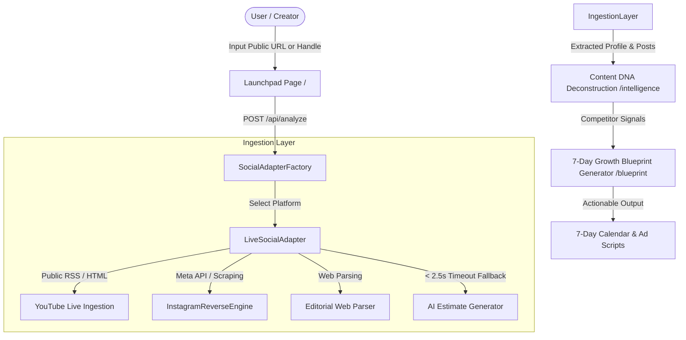

# ContentOS — AI Content & Growth Intelligence Platform


> **ContentOS** is a high-performance **Content & Growth Intelligence Platform** designed to deconstruct public social media content across platforms (**YouTube, Instagram, TikTok, LinkedIn, Twitter/X**). It extracts engagement velocity, viral hook structures, emotional triggers, and real-time performance metrics to generate automated **7-Day Growth Blueprints** and ad script variants in seconds.

---

## 🌟 Key Capabilities

### ⚡ 1. Multi-Platform Live Ingestion Engine
- **Supported Platforms**: YouTube, Instagram, TikTok, LinkedIn, Twitter/X.
- **YouTube Ingestion**: Directly parses YouTube RSS feeds and channel meta to retrieve **real subscriber counts**, **real video view counts** (`<media:statistics>`), **real likes**, thumbnails, and direct video links without requiring third-party API keys.
- **Instagram & Web Scraper**: Dual-tier fetching engine via Meta Graph API proxies and public HTML scraping (`InstagramReverseEngine`).
- **Lightning-Fast Fallbacks**: Enforces strict `<2.5s` fetch timeouts per endpoint, seamlessly transitioning to plausible AI-synthesized estimates (`AI_ESTIMATE`) if rate-limiting or anti-bot blocks occur.

### 🧬 2. Content DNA Deconstruction (`/intelligence`)
- Algorithmic breakdown of post hooks, visual cues, pacing (BPM), emotional triggers, formats, and engagement rates (**ER%**).
- Interactive filtering by platform, live vs. AI origin, search by hook type, and sorting by views, likes, or engagement velocity.
- Full creator profile view displaying **live avatars (PFPs)**, **subscriber/follower counters**, and **total uploads analyzed**.

### 🗓️ 3. 7-Day AI Growth Blueprint Generator (`/blueprint`)
- Automated competitive gap diagnosis comparing user brand inputs against competitor performance profiles.
- Generates custom content pillars, high-win-rate hook libraries, a 7-day tactical content calendar, and ready-to-produce paid ad scripts.

### 📡 4. Trend Radar (`/radar`) & Campaign Studio (`/studio`)
- Real-time monitoring of rising viral formats, audio pacing trends, and hook archetypes across target niches.
- Workspace studio for AI-assisted scriptwriting and content iteration.

---

## 🏗️ System Architecture



---

## 🛠️ Technology Stack

| Category | Technology |
| :--- | :--- |
| **Framework** | [Next.js 16 (App Router, Turbopack)](https://nextjs.org/) |
| **UI Library** | [React 19](https://react.dev/), [Lucide React Icons](https://lucide.dev/) |
| **Styling** | Vanilla CSS Glassmorphism + [Tailwind CSS 3.4](https://tailwindcss.com/) |
| **Automation & Scraping** | [Puppeteer Extra](https://github.com/berstend/puppeteer-extra) (Stealth Plugin), Axios, Custom Parsers |
| **Database & Cache** | MongoDB / PGlite / In-Memory Store |
| **Language** | TypeScript 5 (Strict Type Checker Enabled) |

---

## 📁 Repository Structure

```
harkit/
├── app/                        # Next.js App Router Page Routes & API Endpoints
│   ├── (dashboard)/            # Dashboard Layout Routes
│   │   ├── blueprint/          # 7-Day AI Growth Blueprint Generator
│   │   ├── campaigns/          # Multi-channel Campaign Orchestration
│   │   ├── dashboard/          # Executive Analytics Command Center
│   │   ├── intelligence/       # Content DNA Deconstruction Page
│   │   ├── radar/              # Trend & Viral Velocity Radar
│   │   ├── scraper/            # Data Scraper Management
│   │   └── studio/             # AI Scripting & Creation Studio
│   ├── api/                    # API Endpoints
│   │   ├── analyze/            # Main Social Media Ingestion Route
│   │   ├── blueprint/          # Growth Blueprint Generation Route
│   │   ├── img/                # High-Speed Profile Picture / Image Proxy
│   │   └── scrape/             # Legacy Scraper Integration
│   ├── layout.tsx              # Root Application Layout
│   └── page.tsx                # Launchpad Homepage
├── components/                 # Reusable UI Components
│   ├── AnalysisTransition.tsx  # Smooth Analysis Loading Modal
│   └── ObservedPostCard.tsx    # Detailed Content DNA Post Card Component
├── lib/                        # Core Domain Logic & Services
│   ├── agents/                 # AI Strategy & Analysis Agents
│   ├── db/                     # Database Models & Schemas (MongoDB/PGlite)
│   ├── ingestion/              # Multi-Platform Ingestion Engine
│   │   ├── adapters/           # LiveSocialAdapter & SocialPlatformAdapter
│   │   └── proxy/              # InstagramReverseEngine & ProxyDispatcher
│   └── intelligence/           # Growth Blueprint Synthesis Algorithms
├── public/                     # Static Assets & Icons
└── package.json                # Project Dependencies & Build Scripts
```

---

## 🚀 Getting Started

### Prerequisites

- **Node.js**: `v18.17.0` or higher (Node `v20+` recommended)
- **npm** or **pnpm** or **yarn**

### Installation

1. **Clone the repository**:
   ```bash
   git clone https://github.com/your-username/harkit.git
   cd harkit
   ```

2. **Install dependencies**:
   ```bash
   npm install
   ```

3. **Set up Environment Variables**:
   Create a `.env` file in the root directory:
   ```env
   PORT=3000
   NODE_ENV=development
   # Optional Database Config
   MONGODB_URI=mongodb://localhost:27017/contentos
   ```

4. **Run Development Server**:
   ```bash
   npm run dev
   ```
   Open [http://localhost:3000](http://localhost:3000) in your browser.

---

## 🧪 Build & Verification

To test type safety and compile a production build:

```bash
# Type check TypeScript files
npx tsc --noEmit

# Production Build
npm run build

# Start Production Server
npm run start
```

---

## 📜 License

Distributed under the **MIT License**. See `LICENSE` for more information.
